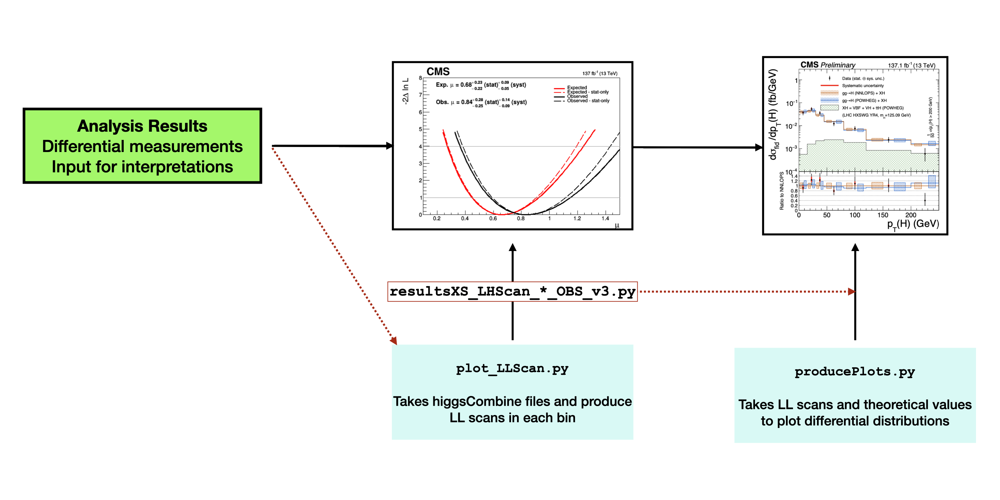

# Likelihood scan


Produce negative log-likelihood scan plots for `OBS` in `OBS_BINS`.
Fit results are produced with [RunFiducialXS.py] and stored in `combine_files`.

To run the script:

```
python plot_LLScan.py --obsName 'OBS' --year 'YEAR' --obsBins 'OBS_BINS' [--unblind True]
```

This expected (observed) fit results are saved in a file named `resultsXS_LHScan_expected(observed)_OBS_v3.py`
which contains a dictionary reporting the central value of the POI and the 1-sigma CL for both inclusive
and stat-only component of the error.

These dictionaries are used as input in [`producePlots.py`](https://github.com/bonanomi/FiducialXSFWK/blob/main/producePlots.py)
to produce the differential xsec plots.
