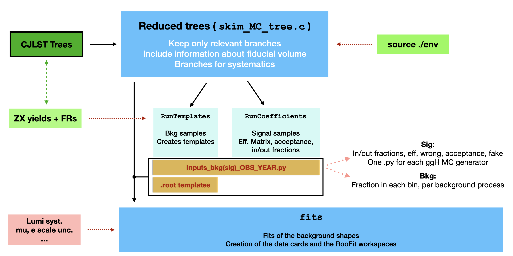
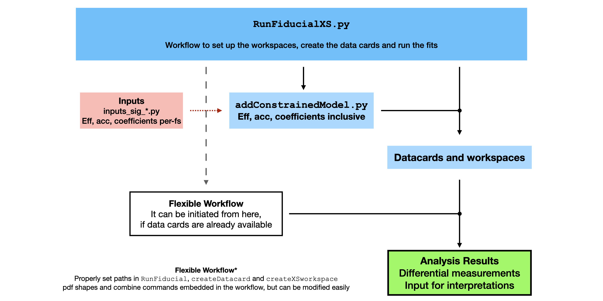

# Fiducial XS measurements in HZZ4L

Standalone framework for fiducial differential cross section measurements using CJLST TTrees for Run 2 data.

A CMSSW working area with the latest version of [`combine`](https://cms-analysis.github.io/HiggsAnalysis-CombinedLimit/) is required:

```
export SCRAM_ARCH=slc7_amd64_gcc700
cmsrel CMSSW_10_2_13
cd CMSSW_10_2_13/src
cmsenv
git clone https://github.com/cms-analysis/HiggsAnalysis-CombinedLimit.git HiggsAnalysis/CombinedLimit
cd HiggsAnalysis/CombinedLimit
git fetch origin
git checkout v8.1.0
scramv1 b clean; scramv1 b
```

The `PhysicsModel(s)` used in this analysis (cf. `fit/createDatacard.py`) can be found in the `models` folder. Please copy them in `$CMSSW_VERSION/src/HiggsAnalysis/CombinedLimit/python` before running the scipts in `fit`.

## Workflow
A schematic representation of the framework's worflow is given in the two following sketches:




The input files of the analysis workflow are the HZZ4L ntuples generated with the [CJLST framework](https://github.com/AlessandroTarabini/ZZAnalysis/tree/Run2_CutBased_BTag16). This framework starts from those files and:

1. `config`: Starting from CJLST TTrees, only relevant branches are selected and stored by `skim_MC_tree.C` and `skim_data_tree.C` macros.

Having created these skimmed TTrees, the next steps of the analysis involve the caluclation of the different coefficients needed for the pdf parameterisations and unfolding, as well as the creation of background templates. To do so:

2. `templates`: Templates and normalization coefficients for the backgrounds' pdf are extracted from MC (ggZZ and qqZZ) and data (ZX) using [`RunTemplates.py`](https://github.com/bonanomi/FiducialXSFWK/tree/main/templates)
3. `coefficients`: All the coefficients of the signal parameterization are calculated with [`RunCoefficients.py`](https://github.com/bonanomi/FiducialXSFWK/blob/main/coefficients/RunCoefficients.py) and stored in `inputs` folder.
4. `fit`: The maximum likelihood fit is performed. This step relies on the [`RunFiducialXS.py`](https://github.com/bonanomi/FiducialXSFWK/blob/main/fit/RunFiducialXS.py) script and it can be run either as part of the entire framework, creating the datacards and workspaces from scratch, or using pre-existing datacars as input. Datacards are produced and stored in a `datacard` directory, while fit results (combine `.root` files) are stored in `combine_files` folder.

Additional scripts are provided to plot negative log-likelihood scans and to produce the usual differential xsec plots:

5. [`LHScans`](https://github.com/bonanomi/FiducialXSFWK/tree/main/LHScans): Likelihood scans are plotted, best-fit values and the corresponding uncertainties are calculated using `plotLHScans_compare.py`.
6. `producePlots.py`: Plot of unfolded differential xsec distributions.
